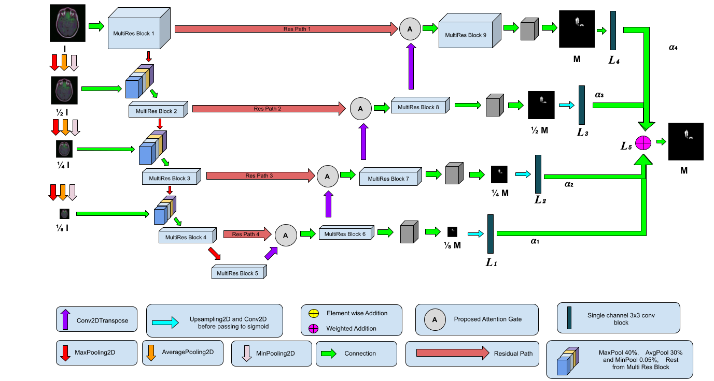
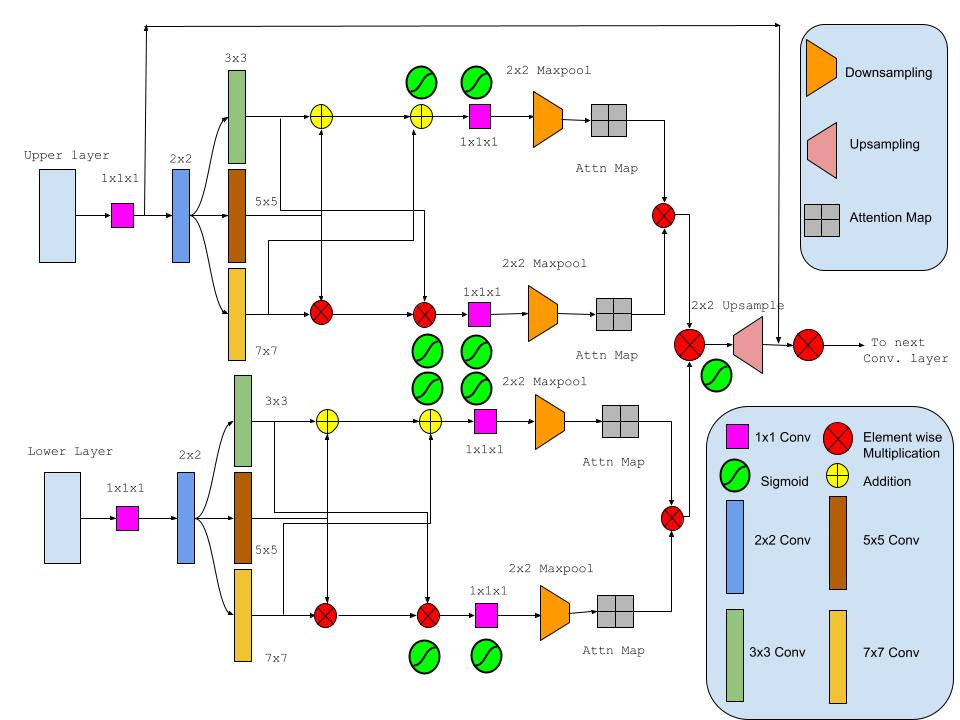
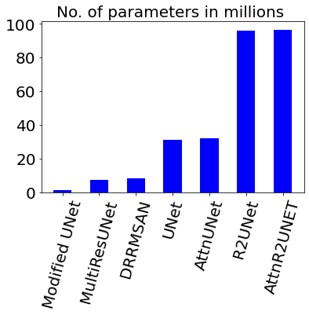
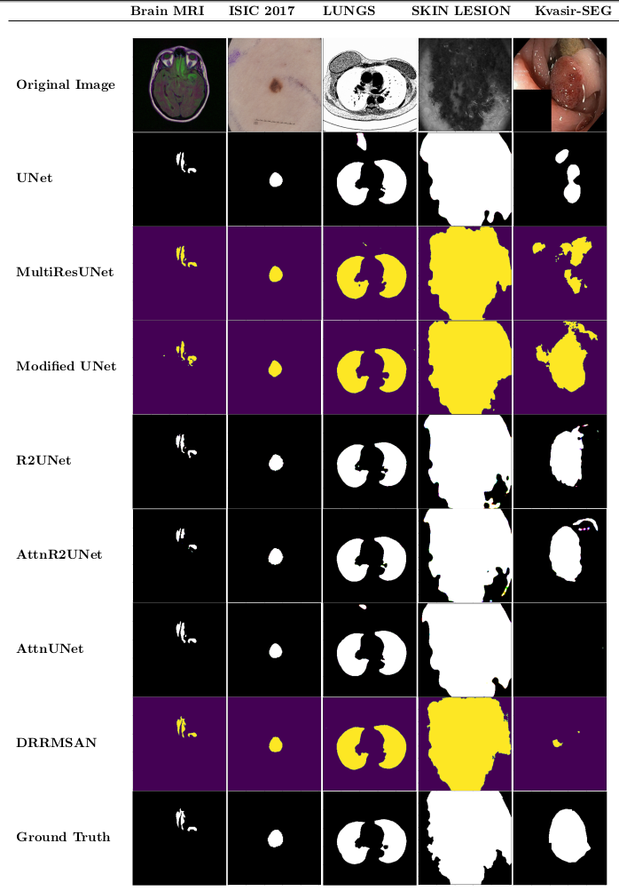

# DRRMSAN

DRRMSAN: Deep Residual Regularized Multi-Scale Attention Networks for segmentation of medical images.

[[Presentation](https://www.youtube.com/watch?v=My7L-ggFbKI)]

## Abstract

Medical sectors are generally presented with challenge of segmenting images with high accuracy. A novel Deep learning architecture is proposed which can segment images at multiple scales, leading to high dice coefficient in majority of challenging datasets, where regions of interest are of different shapes and sizes. Use of attention module within the architecture partly increases the capability of the model to focus on relevant regions. Calculating loss at different scales also helps in incremental reconstruction of segmentation mask. A comparison with other state of the art model shows this model performs better than most with a significantly low computation overhead. This demonstrates the efficiency and reliability of our approach to generate segmentation masks.


## Our proposed model
<center></center>

## Our proposed attention gate
<center></center>

## Evaluation with other models
<center></center>

## Comparison of parameters
<center></center>

## Comparison with other models
<center></center>

## Download the datasets from here:

* [ISIC 2017](https://drive.google.com/u/3/uc?id=1-PAttyqJLImKMdz0gTLM3soiWWvi8PAD)
* [BRAIN MRI](https://drive.google.com/u/3/uc?id=1-YLWaVt4d1MA51Ljid4mznaDg5e1xafc)
* [SKIN LESION](https://drive.google.com/u/0/uc?id=1-OdmzC3JvmUsZUMrNAKPnu8ZM7EeSK04)
* [LUNGS](https://drive.google.com/u/3/uc?id=1wkephfRzoFhrcRbz_7a97_muu8ecSJ9d)
* [KVASIR-SEG](https://drive.google.com/u/3/uc?id=1VzOUEvIyhmOGQUBGzfI7M8GMW2NjIFeH)

## Dependencies for GPU
```
conda install -c anaconda cudatoolkit=10.1.243 cudnn=7.6.5 tensorflow-gpu
```


## Contribution


Please feel free to raise issues and fix any existing ones. Further details can be found in our [code of conduct](https://github.com/Jimut123/drrmsan/blob/master/CODE_OF_CONDUCT.md).

### While making a PR, please make sure you:
- [ ] Always start your PR description with "Fixes #issue_number", if you're fixing an issue.
- [ ] Briefly mention the purpose of the PR, along with the tools/libraries you have used. It would be great if you could be version specific.
- [ ] Briefly mention what logic you used to implement the changes/upgrades.
- [ ] Provide in-code review comments on GitHub to highlight specific LOC if deemed necessary.
- [ ] Please provide snapshots if deemed necessary.
- [ ] Update readme if required.


## TODO

- [ ] Bayesian optimisation 
- [ ] Upsampling using GANs.

## Acknowledgements

It is ritual that scholars express their gratitude to their supervisors.  This acknowledgement is very special to me to express my deepest sense of gratitude and pay respect to my supervisor, ***Dripta Mj***, School of Mathematical Sciences, for his constant encouragement, guidance, supervision, and support throughout the completion of my project. His close scrutiny, constructive criticism, and intellectual insight have immensely helped me in every stage of my work. I would like to thank him for patiently answering my often naive questions related to machine learning. I am also thankful to **Swathy Prabhu Maharaj** for arranging **Asus RTX 2080 Ti GPU (with 64 GB RAM)** to hasten the research. I would also thank **Tamal Maharaj** and **Dr. Jadab Kumar Pal** for their suggestions.

The Authors would also like to thank [lixiaolei1982](https://github.com/lixiaolei1982/Keras-Implementation-of-U-Net-R2U-Net-Attention-U-Net-Attention-R2U-Net.-) and [nibtehaz](https://github.com/nibtehaz/MultiResUNet) for open sourcing their implementations. 


***
